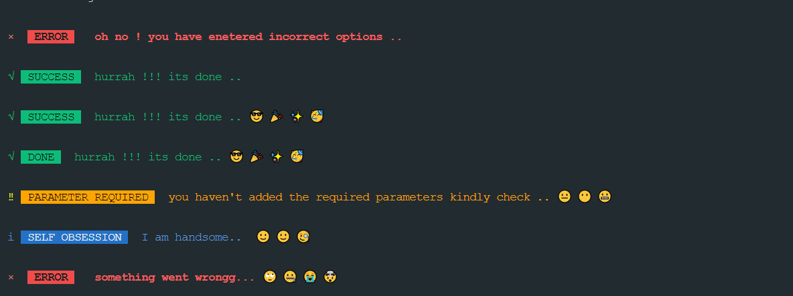

# __emojify-cli-alerts__

> A cross platform CLI Alerts with colors and colored symbols along with emojis🥳🥳🥳 for success, info, warning and error.Works on both MAC OS and Windows

<!--  -->


# install
```sh
npm install emojify-cli-alerts
```

# usage
```javascript
const cli_alerts = require("emojify-cli-alerts");

//pass the relevant options like {type,name,msg} , emojify

// default call
cli_alerts({});
//✖  ERROR    oh no ! you have enetered incorrect options ..

// call with no emojify parameter deafult is false
cli_alerts({
  type: "success",
  msg: "hurrah !!! its done ..",
});
//✔  SUCCESS   hurrah !!! its done ..

//call with emojify parameter
cli_alerts(
  {
    type: "success",
    msg: "hurrah !!! its done ..",
  },
  true
);
//✔  SUCCESS   hurrah !!! its done .. 😎 🎉 ✨ 🥳

//call with name parameter

cli_alerts(
  {
    type: "success",
    msg: "hurrah !!! its done ..",
    name: "done",
  },
  true
);
//✔  DONE   hurrah !!! its done .. 😎 🎉 ✨ 🥳

cli_alerts(
  {
    type: "warning",
    msg: "you haven't added the required parameters kindly check ..",
    name: "parameter required",
  },
  true
);
//⚠  PARAMETER REQUIRED   you haven't added the required parameters kindly check .. 😐 😶 😬

cli_alerts(
  {
    type: "info",
    msg: "I am handsome..",
    name: "self obsession",
  },
  true
);
//ℹ  SELF OBSESSION   I am handsome..  🙂 🙂 🧐

cli_alerts(
  {
    type: "error",
    msg: "something went wrongg...",
  },
  true
);
//✖  ERROR    something went wrongg... 🙄 🤐 😭 🤯


```

# API
##  __cli-alert(options,emojify)__

## options
### Type : object
### Accepted arguments :{type,msg,name} 
### Default : {}

## emojify
### Type : boolean
### Deafult : false

__you can specify the options below__


## type
### Type : string
### Accepted parameters :["success","warning","info","error"]
### Default : error

## msg
### Type : string
### Accepted parameters : any string defining alert message
### Default : oh no ! you have enetered incorrect options ..(error string)


## name
### Type : string
### Accepted parameters : any string defining name of an alert
### Default : same as type parameter


